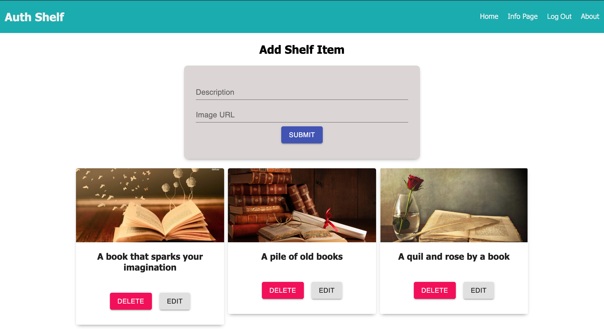

# REACT AUTH SHELF

## Description

Duration: 2 Days

What problem did you solve? How did you solve it?
Using the SERN stack, my group and I were able to create an application that sorts images from a database and displays it in the gallery page based on user ID. Users can other user's image gallery, but can only delete their own.

<!-- To see the fully functional site, please visit: DEPLOYED VERSION OF APP -->

## Wireframe

### Prerequisites

https://nodejs.org/en/

## Installation
This is a step by step list for how another developer could get this project up and running.

1. Create a database named auth_shelf
2. The queries in the tables.sql file are set up to create all the necessary tables and populate the needed data to allow the application to run correctly. The project is built on Postgres, so you will need to make sure to have that installed. I recommend using Postico to run those queries as that was used to create the queries.
3. Open up your editor of choice and run an npm install
4. Run npm run server in your terminal
5. Run npm run client in your terminal
6. The npm run client command will open up a new browser tab for you!

## Usage
You can use this applicaiton to learn more about authorization and authentication to allow different types of access for users with different clearance levels to your app.

## Built With
* SERN Stack
    * SQL
    * Express
    * React
    * Node
    * Material UI

## Acknowledgement
Thanks to Prime Digital Academy in Minneapolis who equipped and helped me to make this application a reality. Special thanks to https://github.com/berg2043, https://github.com/luketpena, and https://github.com/kpeterson24 that helped with different features and components.

## Support
If you have suggestions or issues, please email me at harrisonnguyen517@gmail.com
